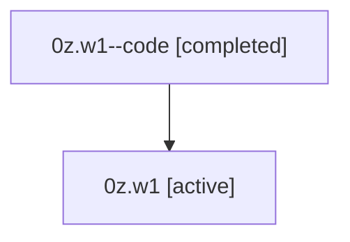

# Family: 0z.w1

[Agent Hoods](../README.md) / [bbugyi200](../users/bbugyi200/README.md) / [athena](../users/bbugyi200/machines/athena/README.md) / [0z](../users/bbugyi200/machines/athena/hoods/0z/README.md) / 0z.w1

Owner: `bbugyi200.athena` · Hood: `0z` · Members: 2

## Lineage

The diagram is an optional enhancement; the ordered table below contains the same lineage in accessible text.

| Role | Agent | State | Model / provider | Timing | Commits | Prompt | Chat |
|---|---|---|---|---|---:|---|---|
| code | 0z.w1--code | completed | gpt-5.5 / codex | 2026-07-07T21:06:03.662431+00:00 | [1](../agents/bbugyi200.athena.0z.w1--code/README.md#commits) | — | [Chat](../agents/bbugyi200.athena.0z.w1--code/chat.md) |
| root | 0z.w1 | active | claude-fable-5 / claude | 2026-07-07T16:53:22.821174 | [2](../agents/bbugyi200.athena.0z.w1/README.md#commits) | [Prompt](../agents/bbugyi200.athena.0z.w1/prompt.md) | [Chat](../agents/bbugyi200.athena.0z.w1/chat.md) |

## Commits

| Role | Repo | Commit | Subject | Committed |
|---|---|---|---|---|
| root | sase | [`9a767bb`](https://github.com/sase-org/sase/commit/9a767bbc2e9975344d42d4eea37aaa5965e2cfbc) | chore: Add SDD prompt and plan for slow\_tool\_call\_failure\_reports | 2026-07-07 21:06:02 UTC |
| code | sase | [`7696aa0`](https://github.com/sase-org/sase/commit/7696aa00e157a706d02ba8956126049892b3b5a8) | feat(tui): add failed tool call report hints | 2026-07-07 21:24:01 UTC |
| root | sase | [`7696aa0`](https://github.com/sase-org/sase/commit/7696aa00e157a706d02ba8956126049892b3b5a8) | feat(tui): add failed tool call report hints | 2026-07-07 21:24:01 UTC |

## Neighbors

| Agent | Relation | State |
|---|---|---|
| [0z](bbugyi200.athena.0z.md) (family · 2) | ancestor | active 1, completed 1 |
| [0z.w1.f1](bbugyi200.athena.0z.w1.f1.md) (family · 2) | descendant | active 1, completed 1 |
