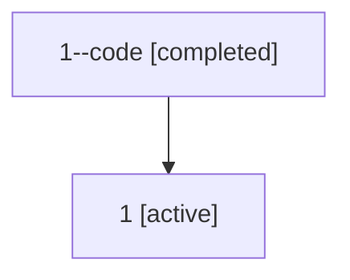

# Family: 1

[Agent Hoods](../README.md) / [bbugyi200](../users/bbugyi200/README.md) / [athena](../users/bbugyi200/machines/athena/README.md) / [1](../users/bbugyi200/machines/athena/hoods/1/README.md) / 1

Owner: `bbugyi200.athena` · Hood: `1` · Members: 2

## Lineage

The diagram is an optional enhancement; the ordered table below contains the same lineage in accessible text.

| Role | Agent | State | Model / provider | Timing | Commits | Prompt | Chat |
|---|---|---|---|---|---:|---|---|
| code | 1--code | completed | gpt-5.5 / codex | 2026-07-06T10:37:03.000748+00:00 | 0 | — | [Chat](../agents/bbugyi200.athena.1--code/chat.md) |
| root | 1 | active | claude-fable-5 / claude | 2026-07-06T10:32:48.387063+00:00 | [6](../agents/bbugyi200.athena.1/README.md#commits) | [Prompt](../agents/bbugyi200.athena.1/prompt.md) | [Chat](../agents/bbugyi200.athena.1/chat.md) |

## Commits

| Role | Repo | Commit | Subject | Committed (UTC) |
|---|---|---|---|---|
| root | sase | [`f1c30a9`](https://github.com/sase-org/sase/commit/f1c30a9366015a245a451b063a5f32437d115ed5) | chore: Add SDD prompt and plan for project\_management\_edit\_keymap\_1 | 2026-06-02 11:00:11 |
| root | sase | [`2ed32d6`](https://github.com/sase-org/sase/commit/2ed32d626b404b2e8c5d4a466ff32d937e6ca466) | feat: add project spec edit keymap | 2026-06-02 11:13:32 |
| root | sase | [`8110c90`](https://github.com/sase-org/sase/commit/8110c905b17c7f4664478d9c3fad96c7f3e905c1) | fix: update research xprompt loader assertions | 2026-06-03 06:58:06 |
| root | sase | [`703ed90`](https://github.com/sase-org/sase/commit/703ed90111823d312344964769de5ce1339000df) | chore: Add SDD prompt and plan for model\_alias\_descriptions | 2026-07-03 10:37:48 |
| root | sase | [`a40aa0d`](https://github.com/sase-org/sase/commit/a40aa0ded2b04adc546c4864546c45e4e7901b48) | chore: Add SDD prompt and plan for mode\_switch\_sync\_dev\_checkouts | 2026-07-06 10:37:01 |
| root | sase | [`a4edccd`](https://github.com/sase-org/sase/commit/a4edccd46a18f6506a25d5ced975518b551cb2e8) | fix(mode-switch): fast-forward reusable dev checkouts | 2026-07-06 10:47:57 |
