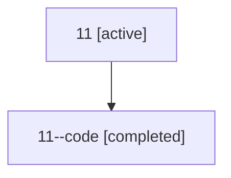

# Family: 11

[Agent Hoods](../README.md) / [bbugyi200](../users/bbugyi200/README.md) / [athena](../users/bbugyi200/machines/athena/README.md) / [11](../users/bbugyi200/machines/athena/hoods/11/README.md) / 11

Owner: `bbugyi200.athena` · Hood: `11` · Members: 2

## Lineage

The diagram is an optional enhancement; the ordered table below contains the same lineage in accessible text.

| Role | Agent | State | Model / provider | Timing | Commits | Prompt | Chat |
|---|---|---|---|---|---:|---|---|
| root | 11 | active | opus / claude | 2026-07-07T20:21:54.508898+00:00 | [2](../agents/bbugyi200.athena.11/README.md#commits) | [Prompt](../agents/bbugyi200.athena.11/prompt.md) | [Chat](../agents/bbugyi200.athena.11/chat.md) |
| code | 11--code | completed | gpt-5.5 / codex | 2026-07-07T20:32:23.777127+00:00 | 0 | — | [Chat](../agents/bbugyi200.athena.11--code/chat.md) |

## Commits

| Role | Repo | Commit | Subject | Committed |
|---|---|---|---|---|
| root | sase | [`53da0b7`](https://github.com/sase-org/sase/commit/53da0b7ab75eaa8af474e34f187ded6706cbd837) | chore: Add SDD prompt and plan for startup\_toast\_incoming\_commits | 2026-07-07 16:32:22 EDT |
| root | sase | [`8465daa`](https://github.com/sase-org/sase/commit/8465daa3564f01ae1b8b6dcc1e8685f07dbadddd) | feat(ace): show incoming commits in startup update toast | 2026-07-07 16:53:17 EDT |
