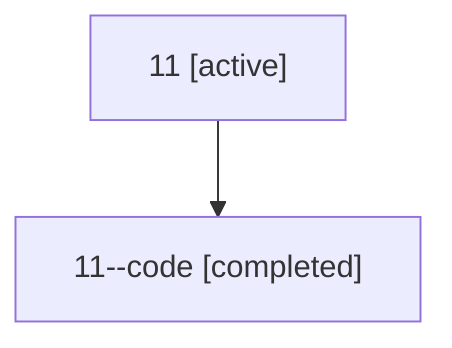

# Family: 11

Owner: `bbugyi200.athena` · Hood: `11` · Members: 2

## Lineage

The diagram is an optional enhancement; the ordered table below contains the same lineage in accessible text.

| Role | Agent | State | Model / provider | Timing | Commits | Prompt | Chat |
|---|---|---|---|---|---:|---|---|
| root | 11 | active | opus / claude | 2026-07-07T20:21:54.508898+00:00 | 2 | [Prompt](../agents/bbugyi200.athena.11/prompt.md) | [Chat](../agents/bbugyi200.athena.11/chat.md) |
| code | 11--code | completed | gpt-5.5 / codex | 2026-07-07T20:32:23.777127+00:00 | 1 | — | [Chat](../agents/bbugyi200.athena.11--code/chat.md) |
