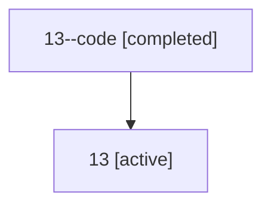

# Family: 13

[Agent Hoods](../README.md) / [bbugyi200](../users/bbugyi200/README.md) / [athena](../users/bbugyi200/machines/athena/README.md) / [13](../users/bbugyi200/machines/athena/hoods/13/README.md) / 13

Owner: `bbugyi200.athena` · Hood: `13` · Members: 2

## Lineage

The diagram is an optional enhancement; the ordered table below contains the same lineage in accessible text.

| Role | Agent | State | Model / provider | Timing | Commits | Prompt | Chat |
|---|---|---|---|---|---:|---|---|
| code | 13--code | completed | gpt-5.5 / codex | 2026-07-07T21:01:00.108396+00:00 | [1](../agents/bbugyi200.athena.13--code/README.md#commits) | — | [Chat](../agents/bbugyi200.athena.13--code/chat.md) |
| root | 13 | active | claude-fable-5 / claude | 2026-07-07T20:46:52.192829+00:00 | [1](../agents/bbugyi200.athena.13/README.md#commits) | [Prompt](../agents/bbugyi200.athena.13/prompt.md) | [Chat](../agents/bbugyi200.athena.13/chat.md) |

## Commits

| Role | Repo | Commit | Subject | Committed |
|---|---|---|---|---|
| root | sase | [`724be6a`](https://github.com/sase-org/sase/commit/724be6afcdec56cc0b4a4188406e425c7998f962) | chore: Add SDD prompt and plan for sase\_commit\_first\_try\_reliability | 2026-07-07 17:00:58 EDT |
| code | sase | [`74d0820`](https://github.com/sase-org/sase/commit/74d0820afe34208f2151bc0ea19c457c9cd7631c) | feat(commit): commit before syncing changes | 2026-07-07 17:36:06 EDT |
