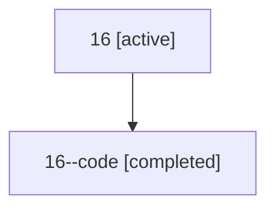

# Family: 16

[Agent Hoods](../README.md) / [bbugyi200](../users/bbugyi200/README.md) / [athena](../users/bbugyi200/machines/athena/README.md) / [16](../users/bbugyi200/machines/athena/hoods/16/README.md) / 16

Owner: `bbugyi200.athena` · Hood: `16` · Members: 2

## Lineage

The diagram is an optional enhancement; the ordered table below contains the same lineage in accessible text.

| Role | Agent | State | Model / provider | Timing | Commits | Prompt | Chat |
|---|---|---|---|---|---:|---|---|
| root | 16 | active | gpt-5.5 / codex | 2026-07-07T21:45:44.416669+00:00 | [2](../agents/bbugyi200.athena.16/README.md#commits) | [Prompt](../agents/bbugyi200.athena.16/prompt.md) | [Chat](../agents/bbugyi200.athena.16/chat.md) |
| code | 16--code | completed | gpt-5.5 / codex | 2026-07-07T21:49:57.300815+00:00 | 0 | — | [Chat](../agents/bbugyi200.athena.16--code/chat.md) |

## Commits

| Role | Commit | Subject | Committed (UTC) |
|---|---|---|---|
| root | [`419bbfd`](https://github.com/sase-org/sase/commit/419bbfddef78e9f89ef4949b3406dbf6480b6136) | chore: Add SDD prompt and plan for telegram\_update\_core | 2026-07-07 21:49:55 |
| root | [`d4ed465`](https://github.com/sase-org/sase/commit/d4ed465fda9267c014146f8f04298a77dcd9e838) | fix: include core package in dev updates | 2026-07-07 21:59:48 |
