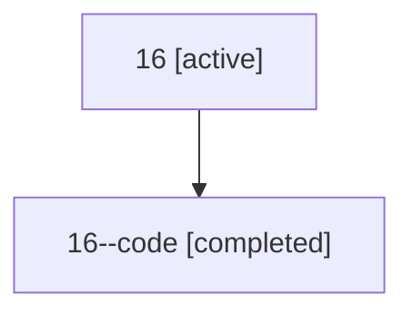

# Family: 16

Owner: `bbugyi200.athena` · Hood: `16` · Members: 2

## Lineage

The diagram is an optional enhancement; the ordered table below contains the same lineage in accessible text.

| Role | Agent | State | Model / provider | Timing | Commits | Prompt | Chat |
|---|---|---|---|---|---:|---|---|
| root | 16 | active | gpt-5.5 / codex | 2026-07-07T21:45:44.416669+00:00 | 2 | [Prompt](../agents/bbugyi200.athena.16/prompt.md) | [Chat](../agents/bbugyi200.athena.16/chat.md) |
| code | 16--code | completed | gpt-5.5 / codex | 2026-07-07T21:49:57.300815+00:00 | 0 | — | [Chat](../agents/bbugyi200.athena.16--code/chat.md) |
