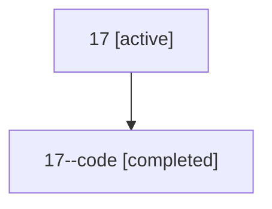

# Family: 17

[Agent Hoods](../README.md) / [bbugyi200](../users/bbugyi200/README.md) / [athena](../users/bbugyi200/machines/athena/README.md) / [17](../users/bbugyi200/machines/athena/hoods/17/README.md) / 17

Owner: `bbugyi200.athena` · Hood: `17` · Members: 2

## Lineage

The diagram is an optional enhancement; the ordered table below contains the same lineage in accessible text.

| Role | Agent | State | Model / provider | Timing | Commits | Prompt | Chat |
|---|---|---|---|---|---:|---|---|
| root | 17 | active | opus / claude | 2026-07-07T21:53:43.088441+00:00 | [4](../agents/bbugyi200.athena.17/README.md#commits) | [Prompt](../agents/bbugyi200.athena.17/prompt.md) | [Chat](../agents/bbugyi200.athena.17/chat.md) |
| code | 17--code | completed | gpt-5.5 / codex | 2026-07-07T22:06:18.325280+00:00 | [1](../agents/bbugyi200.athena.17--code/README.md#commits) | — | [Chat](../agents/bbugyi200.athena.17--code/chat.md) |

## Commits

| Role | Repo | Commit | Subject | Committed |
|---|---|---|---|---|
| root | sase | [`0bcc1dd`](https://github.com/sase-org/sase/commit/0bcc1dd4900733b907e4e44e6e6edab346a77266) | chore: Add SDD prompt and plan for ctrl\_space\_keymap | 2026-06-02 12:55:47 EDT |
| root | sase | [`afcd2f4`](https://github.com/sase-org/sase/commit/afcd2f4d9a607c24e2a824cdc9275f002cc72025) | fix: canonicalize Ctrl+Space keymaps | 2026-06-02 13:11:47 EDT |
| root | sase | [`0ef8267`](https://github.com/sase-org/sase/commit/0ef8267a2cc1a62686406b0e3d584a667fc01b34) | chore: Add SDD prompt and plan for zoom\_panel\_search | 2026-07-07 18:06:17 EDT |
| code | sase | [`f2d82e3`](https://github.com/sase-org/sase/commit/f2d82e3d98ba749df8ecf06469e003b6f023bf00) | feat(ace): add zoom panel search | 2026-07-07 18:34:24 EDT |
| root | sase | [`f2d82e3`](https://github.com/sase-org/sase/commit/f2d82e3d98ba749df8ecf06469e003b6f023bf00) | feat(ace): add zoom panel search | 2026-07-07 18:34:24 EDT |

## Neighbors

| Agent | Relation | State |
|---|---|---|
| [17.f1](../agents/bbugyi200.athena.17.f1/README.md) | descendant | completed |
