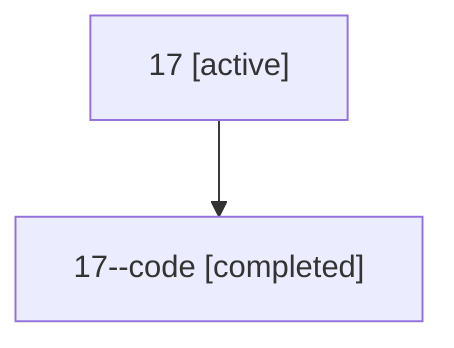

# Family: 17

Owner: `bbugyi200.athena` · Hood: `17` · Members: 2

## Lineage

The diagram is an optional enhancement; the ordered table below contains the same lineage in accessible text.

| Role | Agent | State | Model / provider | Timing | Commits | Prompt | Chat |
|---|---|---|---|---|---:|---|---|
| root | 17 | active | opus / claude | 2026-07-07T21:53:43.088441+00:00 | 4 | [Prompt](../agents/bbugyi200.athena.17/prompt.md) | [Chat](../agents/bbugyi200.athena.17/chat.md) |
| code | 17--code | completed | gpt-5.5 / codex | 2026-07-07T22:06:18.325280+00:00 | 1 | — | [Chat](../agents/bbugyi200.athena.17--code/chat.md) |
