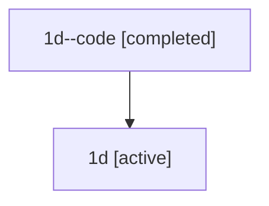

# Family: 1d

Owner: `bbugyi200.athena` · Hood: `1d` · Members: 2

## Lineage

The diagram is an optional enhancement; the ordered table below contains the same lineage in accessible text.

| Role | Agent | State | Model / provider | Timing | Commits | Prompt | Chat |
|---|---|---|---|---|---:|---|---|
| code | 1d--code | completed | gpt-5.5 / codex | 2026-07-08T00:40:44.669502+00:00 | 0 | — | [Chat](../agents/bbugyi200.athena.1d--code/chat.md) |
| root | 1d | active | opus / claude | 2026-07-08T00:25:22.395058+00:00 | 2 | [Prompt](../agents/bbugyi200.athena.1d/prompt.md) | [Chat](../agents/bbugyi200.athena.1d/chat.md) |
