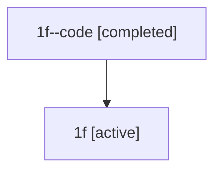

# Family: 1f

Owner: `bbugyi200.athena` · Hood: `1f` · Members: 2

## Lineage

The diagram is an optional enhancement; the ordered table below contains the same lineage in accessible text.

| Role | Agent | State | Model / provider | Timing | Commits | Prompt | Chat |
|---|---|---|---|---|---:|---|---|
| code | 1f--code | completed | gpt-5.5 / codex | 2026-07-08T00:52:56.656413+00:00 | 0 | — | [Chat](../agents/bbugyi200.athena.1f--code/chat.md) |
| root | 1f | active | opus / claude | 2026-07-08T00:38:28.474640+00:00 | 2 | [Prompt](../agents/bbugyi200.athena.1f/prompt.md) | [Chat](../agents/bbugyi200.athena.1f/chat.md) |
