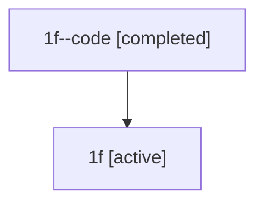

# Family: 1f

[Agent Hoods](../README.md) / [bbugyi200](../users/bbugyi200/README.md) / [athena](../users/bbugyi200/machines/athena/README.md) / [1f](../users/bbugyi200/machines/athena/hoods/1f/README.md) / 1f

Owner: `bbugyi200.athena` · Hood: `1f` · Members: 2

## Lineage

The diagram is an optional enhancement; the ordered table below contains the same lineage in accessible text.

| Role | Agent | State | Model / provider | Timing | Commits | Prompt | Chat |
|---|---|---|---|---|---:|---|---|
| code | 1f--code | completed | gpt-5.5 / codex | 2026-07-08T00:52:56.656413+00:00 | 0 | — | [Chat](../agents/bbugyi200.athena.1f--code/chat.md) |
| root | 1f | active | opus / claude | 2026-07-08T00:38:28.474640+00:00 | [2](../agents/bbugyi200.athena.1f/README.md#commits) | [Prompt](../agents/bbugyi200.athena.1f/prompt.md) | [Chat](../agents/bbugyi200.athena.1f/chat.md) |

## Commits

| Role | Repo | Commit | Subject | Committed (UTC) |
|---|---|---|---|---|
| root | sase | [`755d33f`](https://github.com/sase-org/sase/commit/755d33f31d5df6732adc0cde1dfd7f9a761e3082) | chore: Add SDD prompt and plan for zoom\_panel\_file\_list | 2026-07-08 00:52:55 |
| root | sase | [`c43cd35`](https://github.com/sase-org/sase/commit/c43cd3562f207874c739eb1b867524901f0583da) | feat(ace): add frozen zoom file rail | 2026-07-08 01:19:33 |
