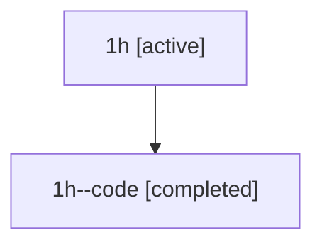

# Family: 1h

[Agent Hoods](../README.md) / [bbugyi200](../users/bbugyi200/README.md) / [athena](../users/bbugyi200/machines/athena/README.md) / [1h](../users/bbugyi200/machines/athena/hoods/1h/README.md) / 1h

Owner: `bbugyi200.athena` · Hood: `1h` · Members: 2

## Lineage

The diagram is an optional enhancement; the ordered table below contains the same lineage in accessible text.

| Role | Agent | State | Model / provider | Timing | Commits | Prompt | Chat |
|---|---|---|---|---|---:|---|---|
| root | 1h | active | opus / claude | 2026-07-08T01:02:34.571558+00:00 | [2](../agents/bbugyi200.athena.1h/README.md#commits) | [Prompt](../agents/bbugyi200.athena.1h/prompt.md) | [Chat](../agents/bbugyi200.athena.1h/chat.md) |
| code | 1h--code | completed | gpt-5.5 / codex | 2026-07-08T01:09:41.409984+00:00 | 0 | — | [Chat](../agents/bbugyi200.athena.1h--code/chat.md) |

## Commits

| Role | Repo | Commit | Subject | Committed (UTC) |
|---|---|---|---|---|
| root | sase | [`1f75a19`](https://github.com/sase-org/sase/commit/1f75a191ed847ea91e42bebddad831103fe63a86) | chore: Add SDD prompt and plan for subagent\_tool\_output | 2026-07-08 01:09:39 |
| root | sase | [`1b33529`](https://github.com/sase-org/sase/commit/1b33529649deeabcd53adf0896507e53ad0a7cd1) | fix: surface subagent final output | 2026-07-08 01:22:40 |
