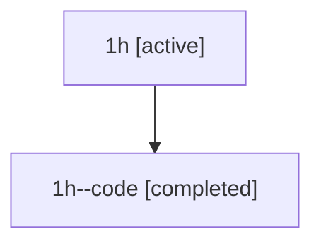

# Family: 1h

Owner: `bbugyi200.athena` · Hood: `1h` · Members: 2

## Lineage

The diagram is an optional enhancement; the ordered table below contains the same lineage in accessible text.

| Role | Agent | State | Model / provider | Timing | Commits | Prompt | Chat |
|---|---|---|---|---|---:|---|---|
| root | 1h | active | opus / claude | 2026-07-08T01:02:34.571558+00:00 | 2 | [Prompt](../agents/bbugyi200.athena.1h/prompt.md) | [Chat](../agents/bbugyi200.athena.1h/chat.md) |
| code | 1h--code | completed | gpt-5.5 / codex | 2026-07-08T01:09:41.409984+00:00 | 0 | — | [Chat](../agents/bbugyi200.athena.1h--code/chat.md) |
