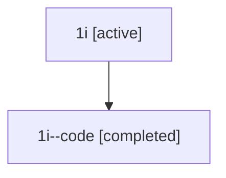

# Family: 1i

[Agent Hoods](../README.md) / [bbugyi200](../users/bbugyi200/README.md) / [athena](../users/bbugyi200/machines/athena/README.md) / [1i](../users/bbugyi200/machines/athena/hoods/1i/README.md) / 1i

Owner: `bbugyi200.athena` · Hood: `1i` · Members: 2

## Lineage

The diagram is an optional enhancement; the ordered table below contains the same lineage in accessible text.

| Role | Agent | State | Model / provider | Timing | Commits | Prompt | Chat |
|---|---|---|---|---|---:|---|---|
| root | 1i | active | gpt-5.5 / codex | 2026-07-08T01:08:03.939689+00:00 | [1](../agents/bbugyi200.athena.1i/README.md#commits) | [Prompt](../agents/bbugyi200.athena.1i/prompt.md) | [Chat](../agents/bbugyi200.athena.1i/chat.md) |
| code | 1i--code | completed | gpt-5.5 / codex | 2026-07-08T01:12:40.240823+00:00 | [1](../agents/bbugyi200.athena.1i--code/README.md#commits) | — | [Chat](../agents/bbugyi200.athena.1i--code/chat.md) |

## Commits

| Role | Repo | Commit | Subject | Committed |
|---|---|---|---|---|
| root | sase | [`31f8436`](https://github.com/sase-org/sase/commit/31f8436d101f62c344dc4f30376dd9dd5569731d) | chore: Add SDD prompt and plan for configurable\_slow\_tool\_threshold | 2026-07-08 01:12:38 UTC |
| code | sase | [`2f3a04c`](https://github.com/sase-org/sase/commit/2f3a04c0508143c3ab29a6bfa07b757742582ae0) | feat(ace): make slow tool threshold configurable | 2026-07-08 01:38:57 UTC |
