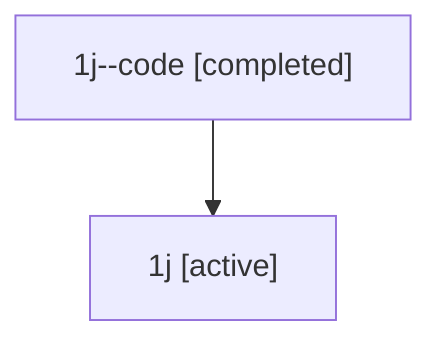

# Family: 1j

[Agent Hoods](../README.md) / [bbugyi200](../users/bbugyi200/README.md) / [athena](../users/bbugyi200/machines/athena/README.md) / [1j](../users/bbugyi200/machines/athena/hoods/1j/README.md) / 1j

Owner: `bbugyi200.athena` · Hood: `1j` · Members: 2

## Lineage

The diagram is an optional enhancement; the ordered table below contains the same lineage in accessible text.

| Role | Agent | State | Model / provider | Timing | Commits | Prompt | Chat |
|---|---|---|---|---|---:|---|---|
| code | 1j--code | completed | gpt-5.5 / codex | 2026-07-08T02:38:53.090635+00:00 | 0 | — | [Chat](../agents/bbugyi200.athena.1j--code/chat.md) |
| root | 1j | active | gpt-5.5 / codex | 2026-07-08T02:34:52.547525+00:00 | [2](../agents/bbugyi200.athena.1j/README.md#commits) | [Prompt](../agents/bbugyi200.athena.1j/prompt.md) | [Chat](../agents/bbugyi200.athena.1j/chat.md) |

## Commits

| Role | Repo | Commit | Subject | Committed |
|---|---|---|---|---|
| root | sase | [`bb7df91`](https://github.com/sase-org/sase/commit/bb7df91fb5fc91f3dd57062b3de7d29af6bca691) | chore: Add SDD prompt and plan for logs\_apostrophe\_jump | 2026-07-07 22:38:51 EDT |
| root | sase | [`54e2cb3`](https://github.com/sase-org/sase/commit/54e2cb3282f7bf3b6b581acbc6ce9c5f44ce1120) | feat(ace): add jump hints to logs pane | 2026-07-07 22:51:48 EDT |
