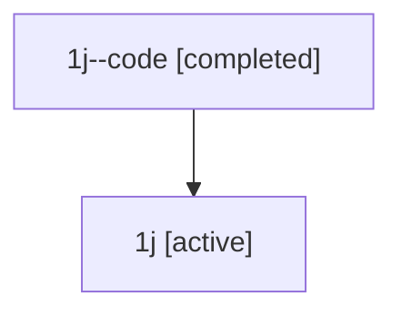

# Family: 1j

Owner: `bbugyi200.athena` · Hood: `1j` · Members: 2

## Lineage

The diagram is an optional enhancement; the ordered table below contains the same lineage in accessible text.

| Role | Agent | State | Model / provider | Timing | Commits | Prompt | Chat |
|---|---|---|---|---|---:|---|---|
| code | 1j--code | completed | gpt-5.5 / codex | 2026-07-08T02:38:53.090635+00:00 | 0 | — | [Chat](../agents/bbugyi200.athena.1j--code/chat.md) |
| root | 1j | active | gpt-5.5 / codex | 2026-07-08T02:34:52.547525+00:00 | 2 | [Prompt](../agents/bbugyi200.athena.1j/prompt.md) | [Chat](../agents/bbugyi200.athena.1j/chat.md) |
