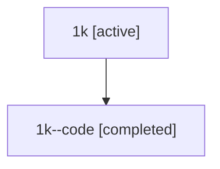

# Family: 1k

[Agent Hoods](../README.md) / [bbugyi200](../users/bbugyi200/README.md) / [athena](../users/bbugyi200/machines/athena/README.md) / [1k](../users/bbugyi200/machines/athena/hoods/1k/README.md) / 1k

Owner: `bbugyi200.athena` · Hood: `1k` · Members: 2

## Lineage

The diagram is an optional enhancement; the ordered table below contains the same lineage in accessible text.

| Role | Agent | State | Model / provider | Timing | Commits | Prompt | Chat |
|---|---|---|---|---|---:|---|---|
| root | 1k | active | opus / claude | 2026-07-08T02:49:44.195170+00:00 | [4](../agents/bbugyi200.athena.1k/README.md#commits) | [Prompt](../agents/bbugyi200.athena.1k/prompt.md) | [Chat](../agents/bbugyi200.athena.1k/chat.md) |
| code | 1k--code | completed | gpt-5.5 / codex | 2026-07-08T03:00:44.678980+00:00 | 0 | — | [Chat](../agents/bbugyi200.athena.1k--code/chat.md) |

## Commits

| Role | Repo | Commit | Subject | Committed |
|---|---|---|---|---|
| root | sase | [`c03fc7f`](https://github.com/sase-org/sase/commit/c03fc7f63d12a2f3c2f97b32350e8c4628bc008e) | chore: Add SDD prompt and plan for artifact\_file\_fallback\_viewer | 2026-06-03 08:31:46 EDT |
| root | sase | [`3e49b5b`](https://github.com/sase-org/sase/commit/3e49b5b102c23d41f25bce03bef8e72a9601eac9) | feat: add text fallback for artifact viewer | 2026-06-03 08:44:41 EDT |
| root | sase | [`41017b9`](https://github.com/sase-org/sase/commit/41017b9745c1b75e4e924a6f45481602e15182e0) | chore: Add SDD prompt and plan for telegram\_output\_variables | 2026-07-07 23:00:43 EDT |
| root | sase | [`a5e3ef5`](https://github.com/sase-org/sase/commit/a5e3ef5f047e69982c4ec041dc2de1abc13f123b) | feat: include output variables in completion notifications | 2026-07-07 23:11:43 EDT |

## Neighbors

| Agent | Relation | State |
|---|---|---|
| [1k.f1](../agents/bbugyi200.athena.1k.f1/README.md) | descendant | active |
