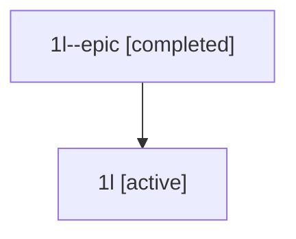

# Family: 1l

[Agent Hoods](../README.md) / [bbugyi200](../users/bbugyi200/README.md) / [athena](../users/bbugyi200/machines/athena/README.md) / [1l](../users/bbugyi200/machines/athena/hoods/1l/README.md) / 1l

Owner: `bbugyi200.athena` · Hood: `1l` · Members: 2

## Lineage

The diagram is an optional enhancement; the ordered table below contains the same lineage in accessible text.

| Role | Agent | State | Model / provider | Timing | Commits | Prompt | Chat |
|---|---|---|---|---|---:|---|---|
| epic | 1l--epic | completed | gpt-5.5 / codex | 2026-07-08T03:22:32.218546+00:00 | [1](../agents/bbugyi200.athena.1l--epic/README.md#commits) | — | [Chat](../agents/bbugyi200.athena.1l--epic/chat.md) |
| root | 1l | active | claude-fable-5 / claude | 2026-07-08T03:06:32.001927+00:00 | [1](../agents/bbugyi200.athena.1l/README.md#commits) | [Prompt](../agents/bbugyi200.athena.1l/prompt.md) | [Chat](../agents/bbugyi200.athena.1l/chat.md) |

## Commits

| Role | Repo | Commit | Subject | Committed |
|---|---|---|---|---|
| root | sase | [`905c1ee`](https://github.com/sase-org/sase/commit/905c1ee8a48b26e2d5b914eceae37d9c5c08b0ab) | chore: Add SDD prompt and plan for sdd\_separate\_repo | 2026-07-07 23:22:30 EDT |
| epic | sase | [`c58554f`](https://github.com/sase-org/sase/commit/c58554f661bbb30714a5a74ec55f971356280d87) | chore: add SDD separate repo epic beads | 2026-07-07 23:33:21 EDT |
