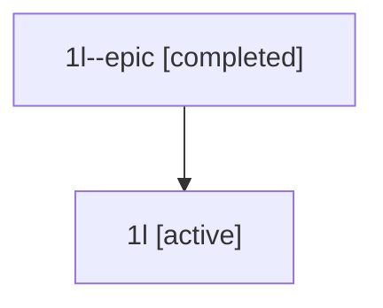

# Family: 1l

Owner: `bbugyi200.athena` · Hood: `1l` · Members: 2

## Lineage

The diagram is an optional enhancement; the ordered table below contains the same lineage in accessible text.

| Role | Agent | State | Model / provider | Timing | Commits | Prompt | Chat |
|---|---|---|---|---|---:|---|---|
| epic | 1l--epic | completed | gpt-5.5 / codex | 2026-07-08T03:22:32.218546+00:00 | 0 | — | [Chat](../agents/bbugyi200.athena.1l--epic/chat.md) |
| root | 1l | active | claude-fable-5 / claude | 2026-07-08T03:06:32.001927+00:00 | 2 | [Prompt](../agents/bbugyi200.athena.1l/prompt.md) | [Chat](../agents/bbugyi200.athena.1l/chat.md) |
