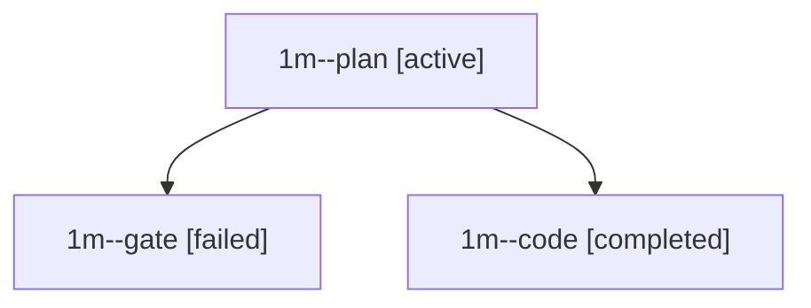

# Family: 1m

[Agent Hoods](../README.md) / [bbugyi200](../users/bbugyi200/README.md) / [athena](../users/bbugyi200/machines/athena/README.md) / [1m](../users/bbugyi200/machines/athena/hoods/1m/README.md) / 1m

Owner: `bbugyi200.athena` · Hood: `1m` · Members: 3

## Lineage

The diagram is an optional enhancement; the ordered table below contains the same lineage in accessible text.

| Role | Agent | State | Model / provider | Timing | Commits | Prompt | Chat |
|---|---|---|---|---|---:|---|---|
| plan | 1m--plan | active | opus / claude | 2026-09-13T11:25:37.409441+00:00 | 0 | [Prompt](../agents/bbugyi200.athena.1m--plan/prompt.md) | [Chat](../agents/bbugyi200.athena.1m--plan/chat.md) |
| gate | 1m--gate | failed | opus / claude | 2026-09-13T11:34:43.814174+00:00 → 2026-09-13T11:36:48.657223+00:00 | 0 | — | [Chat](../agents/bbugyi200.athena.1m--gate/chat.md) |
| code | 1m--code | completed | grok-4.6 / grok | 2026-09-13T11:36:55.931517+00:00 → 2026-09-13T12:20:09.127696+00:00 | [1](../agents/bbugyi200.athena.1m--code/README.md#commits) | [Prompt](../agents/bbugyi200.athena.1m--code/prompt.md) | [Chat](../agents/bbugyi200.athena.1m--code/chat.md) |

## Commits

| Role | Repo | Commit | Subject | Committed |
|---|---|---|---|---|
| code | sase | [`21cdb65`](https://github.com/sase-org/sase/commit/21cdb658b05246ca5b19efa1a81f73d19bc7a87d) | feat(ace): mirror a lone running clan member's status on the clan row | 2026-09-13 08:18:45 EDT |
