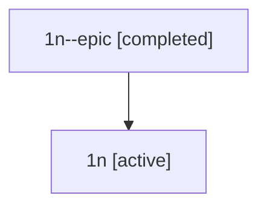

# Family: 1n

Owner: `bbugyi200.athena` · Hood: `1n` · Members: 2

## Lineage

The diagram is an optional enhancement; the ordered table below contains the same lineage in accessible text.

| Role | Agent | State | Model / provider | Timing | Commits | Prompt | Chat |
|---|---|---|---|---|---:|---|---|
| epic | 1n--epic | completed | gpt-5.5 / codex | 2026-07-08T03:59:31.941269+00:00 | 0 | — | [Chat](../agents/bbugyi200.athena.1n--epic/chat.md) |
| root | 1n | active | claude-fable-5 / claude | 2026-07-08T03:46:47.351354+00:00 | 2 | [Prompt](../agents/bbugyi200.athena.1n/prompt.md) | [Chat](../agents/bbugyi200.athena.1n/chat.md) |
