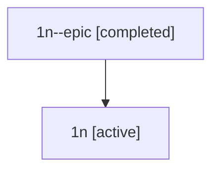

# Family: 1n

[Agent Hoods](../README.md) / [bbugyi200](../users/bbugyi200/README.md) / [athena](../users/bbugyi200/machines/athena/README.md) / [1n](../users/bbugyi200/machines/athena/hoods/1n/README.md) / 1n

Owner: `bbugyi200.athena` · Hood: `1n` · Members: 2

## Lineage

The diagram is an optional enhancement; the ordered table below contains the same lineage in accessible text.

| Role | Agent | State | Model / provider | Timing | Commits | Prompt | Chat |
|---|---|---|---|---|---:|---|---|
| epic | 1n--epic | completed | gpt-5.5 / codex | 2026-07-08T03:59:31.941269+00:00 | [1](../agents/bbugyi200.athena.1n--epic/README.md#commits) | — | [Chat](../agents/bbugyi200.athena.1n--epic/chat.md) |
| root | 1n | active | claude-fable-5 / claude | 2026-07-08T03:46:47.351354+00:00 | [1](../agents/bbugyi200.athena.1n/README.md#commits) | [Prompt](../agents/bbugyi200.athena.1n/prompt.md) | [Chat](../agents/bbugyi200.athena.1n/chat.md) |

## Commits

| Role | Repo | Commit | Subject | Committed |
|---|---|---|---|---|
| root | sase | [`461c619`](https://github.com/sase-org/sase/commit/461c6196d1df648a0cb97ac61213e2d51f27565a) | chore: Add SDD prompt and plan for first\_blog\_post | 2026-07-08 03:59:30 UTC |
| epic | sase | [`05ec540`](https://github.com/sase-org/sase/commit/05ec54063c2b2fa993caf4223f5aeb3150ecaa83) | chore: create first blog post epic beads | 2026-07-08 04:08:22 UTC |
