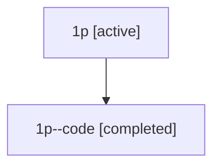

# Family: 1p

Owner: `bbugyi200.athena` · Hood: `1p` · Members: 2

## Lineage

The diagram is an optional enhancement; the ordered table below contains the same lineage in accessible text.

| Role | Agent | State | Model / provider | Timing | Commits | Prompt | Chat |
|---|---|---|---|---|---:|---|---|
| root | 1p | active | gpt-5.5 / codex | 2026-07-08T04:07:11.653877+00:00 | 2 | [Prompt](../agents/bbugyi200.athena.1p/prompt.md) | [Chat](../agents/bbugyi200.athena.1p/chat.md) |
| code | 1p--code | completed | gpt-5.5 / codex | 2026-07-08T04:10:13.931763+00:00 | 1 | — | [Chat](../agents/bbugyi200.athena.1p--code/chat.md) |
