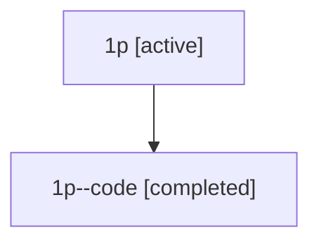

# Family: 1p

[Agent Hoods](../README.md) / [bbugyi200](../users/bbugyi200/README.md) / [athena](../users/bbugyi200/machines/athena/README.md) / [1p](../users/bbugyi200/machines/athena/hoods/1p/README.md) / 1p

Owner: `bbugyi200.athena` · Hood: `1p` · Members: 2

## Lineage

The diagram is an optional enhancement; the ordered table below contains the same lineage in accessible text.

| Role | Agent | State | Model / provider | Timing | Commits | Prompt | Chat |
|---|---|---|---|---|---:|---|---|
| root | 1p | active | gpt-5.5 / codex | 2026-07-08T04:07:11.653877+00:00 | [2](../agents/bbugyi200.athena.1p/README.md#commits) | [Prompt](../agents/bbugyi200.athena.1p/prompt.md) | [Chat](../agents/bbugyi200.athena.1p/chat.md) |
| code | 1p--code | completed | gpt-5.5 / codex | 2026-07-08T04:10:13.931763+00:00 | 0 | — | [Chat](../agents/bbugyi200.athena.1p--code/chat.md) |

## Commits

| Role | Repo | Commit | Subject | Committed |
|---|---|---|---|---|
| root | sase | [`24c7cf6`](https://github.com/sase-org/sase/commit/24c7cf6691b88f30f6b00ded45a0ecd750a12d84) | chore: Add SDD prompt and plan for phase\_bead\_epic\_plan | 2026-07-08 00:10:12 EDT |
| root | sase | [`36f89b7`](https://github.com/sase-org/sase/commit/36f89b7724fd2b67920769b4c452dd4e9f72dfe5) | feat(bead): show parent epic plans for phase beads | 2026-07-08 00:21:56 EDT |
