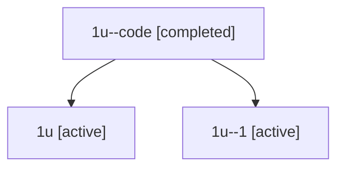

# Family: 1u

Owner: `bbugyi200.athena` · Hood: `1u` · Members: 3

## Lineage

The diagram is an optional enhancement; the ordered table below contains the same lineage in accessible text.

| Role | Agent | State | Model / provider | Timing | Commits | Prompt | Chat |
|---|---|---|---|---|---:|---|---|
| code | 1u--code | completed | gpt-5.5 / codex | 2026-07-08T07:02:53.402317+00:00 | 0 | — | [Chat](../agents/bbugyi200.athena.1u--code/chat.md) |
| root | 1u | active | opus / claude | 2026-07-08T06:47:14.245333+00:00 | 3 | [Prompt](../agents/bbugyi200.athena.1u/prompt.md) | [Chat](../agents/bbugyi200.athena.1u/chat.md) |
| 1 | 1u--1 | active | opus / claude | 2026-07-08T06:54:42.334153+00:00 | 0 | — | [Chat](../agents/bbugyi200.athena.1u--1/chat.md) |
