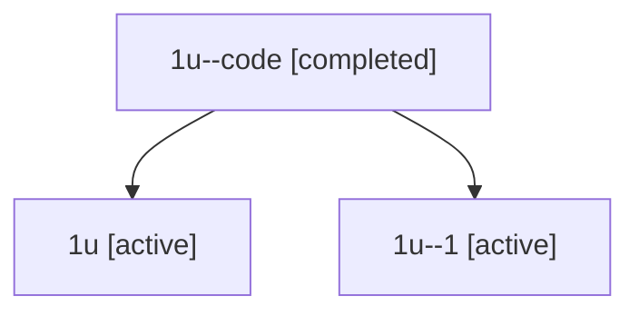

# Family: 1u

[Agent Hoods](../README.md) / [bbugyi200](../users/bbugyi200/README.md) / [athena](../users/bbugyi200/machines/athena/README.md) / [1u](../users/bbugyi200/machines/athena/hoods/1u/README.md) / 1u

Owner: `bbugyi200.athena` · Hood: `1u` · Members: 3

## Lineage

The diagram is an optional enhancement; the ordered table below contains the same lineage in accessible text.

| Role | Agent | State | Model / provider | Timing | Commits | Prompt | Chat |
|---|---|---|---|---|---:|---|---|
| code | 1u--code | completed | gpt-5.5 / codex | 2026-07-08T07:02:53.402317+00:00 | 0 | — | [Chat](../agents/bbugyi200.athena.1u--code/chat.md) |
| root | 1u | active | opus / claude | 2026-07-08T06:47:14.245333+00:00 | [3](../agents/bbugyi200.athena.1u/README.md#commits) | [Prompt](../agents/bbugyi200.athena.1u/prompt.md) | [Chat](../agents/bbugyi200.athena.1u/chat.md) |
| 1 | 1u--1 | active | opus / claude | 2026-07-08T06:54:42.334153+00:00 | 0 | — | [Chat](../agents/bbugyi200.athena.1u--1/chat.md) |

## Commits

| Role | Repo | Commit | Subject | Committed (UTC) |
|---|---|---|---|---|
| root | sase | [`abbc8ac`](https://github.com/sase-org/sase/commit/abbc8ac6d6ef9ff34ffcaaa126057058bd8b1cc7) | chore: Add SDD prompt and plan for migrate\_sdd\_to\_companion\_repo | 2026-07-08 07:02:52 |
| root | sase | [`646eb60`](https://github.com/sase-org/sase/commit/646eb602f8c753e04dc47d13f51f066dd1c37b4c) | Remove migrated in-tree SDD files | 2026-07-08 07:34:45 |
| root | sase | [`e33fc5b`](https://github.com/sase-org/sase/commit/e33fc5b7db7d9e75c2b33cdaec1aef2b12702733) | feat: support migrated separate repo SDD stores | 2026-07-08 07:34:45 |
