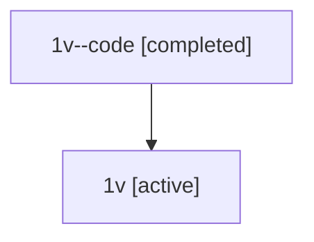

# Family: 1v

[Agent Hoods](../README.md) / [bbugyi200](../users/bbugyi200/README.md) / [athena](../users/bbugyi200/machines/athena/README.md) / [1v](../users/bbugyi200/machines/athena/hoods/1v/README.md) / 1v

Owner: `bbugyi200.athena` · Hood: `1v` · Members: 2

## Lineage

The diagram is an optional enhancement; the ordered table below contains the same lineage in accessible text.

| Role | Agent | State | Model / provider | Timing | Commits | Prompt | Chat |
|---|---|---|---|---|---:|---|---|
| code | 1v--code | completed | gpt-5.5 / codex | 2026-07-08T07:01:46.897958+00:00 | [1](../agents/bbugyi200.athena.1v--code/README.md#commits) | — | [Chat](../agents/bbugyi200.athena.1v--code/chat.md) |
| root | 1v | active | gpt-5.5 / codex | 2026-07-08T06:57:12.910477+00:00 | [4](../agents/bbugyi200.athena.1v/README.md#commits) | [Prompt](../agents/bbugyi200.athena.1v/prompt.md) | [Chat](../agents/bbugyi200.athena.1v/chat.md) |

## Commits

| Role | Repo | Commit | Subject | Committed |
|---|---|---|---|---|
| root | sase | [`9b07496`](https://github.com/sase-org/sase/commit/9b074966abfdd6a080008e7a0cf35ff092405b8a) | chore: Add SDD prompt and plan for bob\_dataview\_reads | 2026-06-03 15:55:48 EDT |
| root | sase | [`66305ab`](https://github.com/sase-org/sase/commit/66305ab993758c2e42911d27ae8c17a7d6f551d5) | chore: create bob dataview reads beads | 2026-06-03 15:59:42 EDT |
| root | sase | [`b0d8eae`](https://github.com/sase-org/sase/commit/b0d8eaeb8df43e37f9d008b4e648dfdc478911a4) | chore: Add SDD prompt and plan for logs\_tab\_jump\_hints | 2026-07-08 03:01:45 EDT |
| code | sase | [`5e9300e`](https://github.com/sase-org/sase/commit/5e9300e1129d84c8964a8811f85539c6a370a57a) | test: cover log jump hints in admin center | 2026-07-08 03:09:06 EDT |
| root | sase | [`5e9300e`](https://github.com/sase-org/sase/commit/5e9300e1129d84c8964a8811f85539c6a370a57a) | test: cover log jump hints in admin center | 2026-07-08 03:09:06 EDT |
