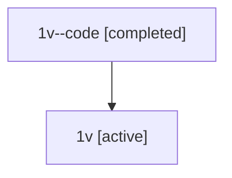

# Family: 1v

Owner: `bbugyi200.athena` · Hood: `1v` · Members: 2

## Lineage

The diagram is an optional enhancement; the ordered table below contains the same lineage in accessible text.

| Role | Agent | State | Model / provider | Timing | Commits | Prompt | Chat |
|---|---|---|---|---|---:|---|---|
| code | 1v--code | completed | gpt-5.5 / codex | 2026-07-08T07:01:46.897958+00:00 | 1 | — | [Chat](../agents/bbugyi200.athena.1v--code/chat.md) |
| root | 1v | active | gpt-5.5 / codex | 2026-07-08T06:57:12.910477+00:00 | 4 | [Prompt](../agents/bbugyi200.athena.1v/prompt.md) | [Chat](../agents/bbugyi200.athena.1v/chat.md) |
