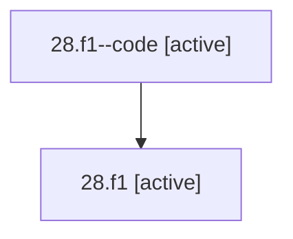

# Family: 28.f1

Owner: `bbugyi200.athena` · Hood: `28` · Members: 2

## Lineage

The diagram is an optional enhancement; the ordered table below contains the same lineage in accessible text.

| Role | Agent | State | Model / provider | Timing | Commits | Prompt | Chat |
|---|---|---|---|---|---:|---|---|
| code | 28.f1--code | active | gpt-5.5 / codex | 2026-07-08T18:13:33.932535+00:00 | 0 | — | — |
| root | 28.f1 | active | opus / claude | 2026-07-08T17:59:20.711643+00:00 | 0 | [Prompt](../agents/bbugyi200.athena.28.f1/prompt.md) | [Chat](../agents/bbugyi200.athena.28.f1/chat.md) |
