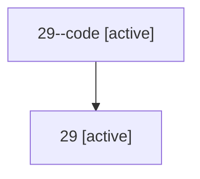

# Family: 29

Owner: `bbugyi200.athena` · Hood: `29` · Members: 2

## Lineage

The diagram is an optional enhancement; the ordered table below contains the same lineage in accessible text.

| Role | Agent | State | Model / provider | Timing | Commits | Prompt | Chat |
|---|---|---|---|---|---:|---|---|
| code | 29--code | active | gpt-5.5 / codex | 2026-07-08T17:50:27.483599+00:00 | 0 | — | — |
| root | 29 | active | opus / claude | 2026-07-08T17:45:40.927064+00:00 | 2 | [Prompt](../agents/bbugyi200.athena.29/prompt.md) | [Chat](../agents/bbugyi200.athena.29/chat.md) |
