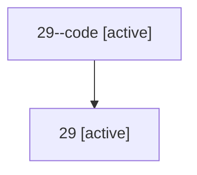

# Family: 29

[Agent Hoods](../README.md) / [bbugyi200](../users/bbugyi200/README.md) / [athena](../users/bbugyi200/machines/athena/README.md) / [29](../users/bbugyi200/machines/athena/hoods/29/README.md) / 29

Owner: `bbugyi200.athena` · Hood: `29` · Members: 2

## Lineage

The diagram is an optional enhancement; the ordered table below contains the same lineage in accessible text.

| Role | Agent | State | Model / provider | Timing | Commits | Prompt | Chat |
|---|---|---|---|---|---:|---|---|
| code | 29--code | active | gpt-5.5 / codex | 2026-07-08T17:50:27.483599+00:00 | 0 | — | — |
| root | 29 | active | opus / claude | 2026-07-08T17:45:40.927064+00:00 | 0 | [Prompt](../agents/bbugyi200.athena.29/prompt.md) | [Chat](../agents/bbugyi200.athena.29/chat.md) |

## Commits

| Role | Repo | Commit | Subject | Committed |
|---|---|---|---|---|
| — | sase | [`84f289d`](https://github.com/sase-org/sase/commit/84f289dd3a1308294c2a21c9088d13f46800714a) | chore: Add SDD prompt and plan for project\_aliases | 2026-06-04 14:31:57 UTC |
| — | sase | [`1a95ca1`](https://github.com/sase-org/sase/commit/1a95ca19252098a693e563d203a6f9b31327556b) | chore: create project aliases epic beads | 2026-06-04 14:37:13 UTC |

## Neighbors

| Agent | Relation | State |
|---|---|---|
| [29.f1](../agents/bbugyi200.athena.29.f1/README.md) | descendant | waiting |
