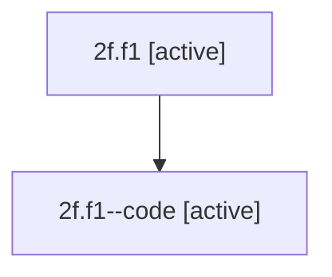

# Family: 2f.f1

[Agent Hoods](../README.md) / [bbugyi200](../users/bbugyi200/README.md) / [athena](../users/bbugyi200/machines/athena/README.md) / [2f](../users/bbugyi200/machines/athena/hoods/2f/README.md) / 2f.f1

Owner: `bbugyi200.athena` · Hood: `2f` · Members: 2

## Lineage

The diagram is an optional enhancement; the ordered table below contains the same lineage in accessible text.

| Role | Agent | State | Model / provider | Timing | Commits | Prompt | Chat |
|---|---|---|---|---|---:|---|---|
| root | 2f.f1 | active | opus / claude | 2026-07-08T18:23:46.726047+00:00 | 0 | [Prompt](../agents/bbugyi200.athena.2f.f1/prompt.md) | [Chat](../agents/bbugyi200.athena.2f.f1/chat.md) |
| code | 2f.f1--code | active | opus / claude | 2026-07-08T18:27:55.604232+00:00 | 0 | — | — |

## Neighbors

| Agent | Relation | State |
|---|---|---|
| [2f](../agents/bbugyi200.athena.2f/README.md) | ancestor | active |
