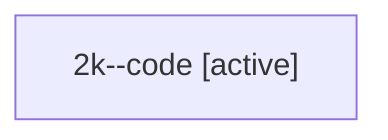

# Family: 2k

[Agent Hoods](../README.md) / [bbugyi200](../users/bbugyi200/README.md) / [athena](../users/bbugyi200/machines/athena/README.md) / [2k](../users/bbugyi200/machines/athena/hoods/2k/README.md) / 2k

Owner: `bbugyi200.athena` · Hood: `2k` · Members: 1

## Lineage

The diagram is an optional enhancement; the ordered table below contains the same lineage in accessible text.

| Role | Agent | State | Model / provider | Timing | Commits | Prompt | Chat |
|---|---|---|---|---|---:|---|---|
| code | 2k--code | active | gpt-5.5 / codex | 2026-07-08T18:45:57.385977+00:00 | 0 | — | — |

## Neighbors

| Agent | Relation | State |
|---|---|---|
| [2k.cdx](../agents/bbugyi200.athena.2k.cdx/README.md) | descendant | completed |
