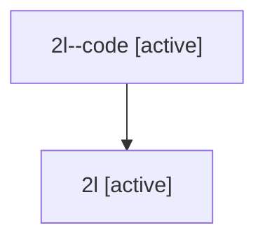

# Family: 2l

Owner: `bbugyi200.athena` · Hood: `2l` · Members: 2

## Lineage

The diagram is an optional enhancement; the ordered table below contains the same lineage in accessible text.

| Role | Agent | State | Model / provider | Timing | Commits | Prompt | Chat |
|---|---|---|---|---|---:|---|---|
| code | 2l--code | active | gpt-5.5 / codex | 2026-07-08T18:55:06.370282+00:00 | 0 | — | — |
| root | 2l | active | gpt-5.5 / codex | 2026-07-08T18:49:26.094809+00:00 | 2 | [Prompt](../agents/bbugyi200.athena.2l/prompt.md) | [Chat](../agents/bbugyi200.athena.2l/chat.md) |
