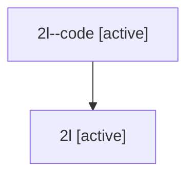

# Family: 2l

[Agent Hoods](../README.md) / [bbugyi200](../users/bbugyi200/README.md) / [athena](../users/bbugyi200/machines/athena/README.md) / [2l](../users/bbugyi200/machines/athena/hoods/2l/README.md) / 2l

Owner: `bbugyi200.athena` · Hood: `2l` · Members: 2

## Lineage

The diagram is an optional enhancement; the ordered table below contains the same lineage in accessible text.

| Role | Agent | State | Model / provider | Timing | Commits | Prompt | Chat |
|---|---|---|---|---|---:|---|---|
| code | 2l--code | active | gpt-5.5 / codex | 2026-07-08T18:55:06.370282+00:00 | 0 | — | — |
| root | 2l | active | gpt-5.5 / codex | 2026-07-08T18:49:26.094809+00:00 | 0 | [Prompt](../agents/bbugyi200.athena.2l/prompt.md) | [Chat](../agents/bbugyi200.athena.2l/chat.md) |

## Commits

| Role | Repo | Commit | Subject | Committed |
|---|---|---|---|---|
| — | sase | [`29562f8`](https://github.com/sase-org/sase/commit/29562f84d790afcc741a7cef57469db39dbfe0d0) | chore: Add SDD prompt and plan for prompt\_ctrl\_r\_recursive\_finder | 2026-06-05 17:28:04 UTC |
| — | sase | [`d09221b`](https://github.com/sase-org/sase/commit/d09221b2be7a033acb3689f71ebc9169af50bc0f) | feat: add ctrl+r recursive fuzzy file finder to the prompt input | 2026-06-05 18:03:41 UTC |
