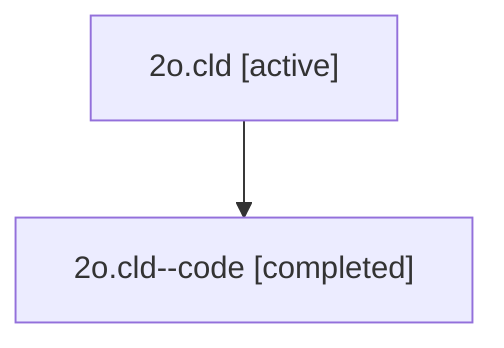

# Family: 2o.cld

[Agent Hoods](../README.md) / [bbugyi200](../users/bbugyi200/README.md) / [athena](../users/bbugyi200/machines/athena/README.md) / [2o](../users/bbugyi200/machines/athena/hoods/2o/README.md) / 2o.cld

Owner: `bbugyi200.athena` · Hood: `2o` · Members: 2

## Lineage

The diagram is an optional enhancement; the ordered table below contains the same lineage in accessible text.

| Role | Agent | State | Model / provider | Timing | Commits | Prompt | Chat |
|---|---|---|---|---|---:|---|---|
| root | 2o.cld | active | opus / claude | 2026-07-08T19:01:29.174994+00:00 | [1](../agents/bbugyi200.athena.2o.cld/README.md#commits) | [Prompt](../agents/bbugyi200.athena.2o.cld/prompt.md) | [Chat](../agents/bbugyi200.athena.2o.cld/chat.md) |
| code | 2o.cld--code | completed | gpt-5.5 / codex | 2026-07-08T19:14:34.158991+00:00 | 0 | — | [Chat](../agents/bbugyi200.athena.2o.cld--code/chat.md) |

## Commits

| Role | Repo | Commit | Subject | Committed |
|---|---|---|---|---|
| root | sase | [`9de5384`](https://github.com/sase-org/sase/commit/9de538432c7f5facaad3c9a3508292c8b6715439) | fix(sdd): sync separate SDD stores per workspace | 2026-07-08 15:39:16 EDT |

## Neighbors

| Agent | Relation | State |
|---|---|---|
| [2o.cdx](../agents/bbugyi200.athena.2o.cdx/README.md) | 2o hood | active |
