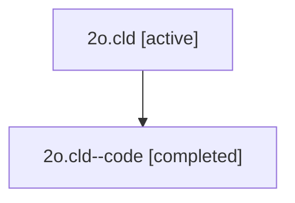

# Family: 2o.cld

Owner: `bbugyi200.athena` · Hood: `2o` · Members: 2

## Lineage

The diagram is an optional enhancement; the ordered table below contains the same lineage in accessible text.

| Role | Agent | State | Model / provider | Timing | Commits | Prompt | Chat |
|---|---|---|---|---|---:|---|---|
| root | 2o.cld | active | opus / claude | 2026-07-08T19:01:29.174994+00:00 | 1 | [Prompt](../agents/bbugyi200.athena.2o.cld/prompt.md) | [Chat](../agents/bbugyi200.athena.2o.cld/chat.md) |
| code | 2o.cld--code | completed | gpt-5.5 / codex | 2026-07-08T19:14:34.158991+00:00 | 0 | — | [Chat](../agents/bbugyi200.athena.2o.cld--code/chat.md) |
