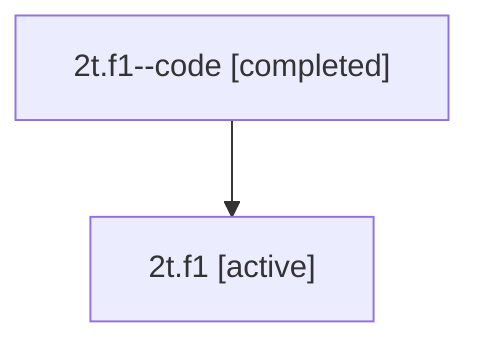

# Family: 2t.f1

[Agent Hoods](../README.md) / [bbugyi200](../users/bbugyi200/README.md) / [athena](../users/bbugyi200/machines/athena/README.md) / [2t](../users/bbugyi200/machines/athena/hoods/2t/README.md) / 2t.f1

Owner: `bbugyi200.athena` · Hood: `2t` · Members: 2

## Lineage

The diagram is an optional enhancement; the ordered table below contains the same lineage in accessible text.

| Role | Agent | State | Model / provider | Timing | Commits | Prompt | Chat |
|---|---|---|---|---|---:|---|---|
| code | 2t.f1--code | completed | gpt-5.5 / codex | 2026-07-08T20:04:17.154188+00:00 | [1](../agents/bbugyi200.athena.2t.f1--code/README.md#commits) | — | [Chat](../agents/bbugyi200.athena.2t.f1--code/chat.md) |
| root | 2t.f1 | active | opus / claude | 2026-07-08T20:00:04.970909+00:00 | [1](../agents/bbugyi200.athena.2t.f1/README.md#commits) | [Prompt](../agents/bbugyi200.athena.2t.f1/prompt.md) | [Chat](../agents/bbugyi200.athena.2t.f1/chat.md) |

## Commits

| Role | Repo | Commit | Subject | Committed (UTC) |
|---|---|---|---|---|
| code | sase | [`affbc4d`](https://github.com/sase-org/sase/commit/affbc4d4e8e2526da54c75f0d6bbdba87b2953be) | fix(vcs-log): show primary project display name | 2026-07-08 20:08:25 |
| root | sase | [`affbc4d`](https://github.com/sase-org/sase/commit/affbc4d4e8e2526da54c75f0d6bbdba87b2953be) | fix(vcs-log): show primary project display name | 2026-07-08 20:08:25 |

## Neighbors

| Agent | Relation | State |
|---|---|---|
| [2t](../agents/bbugyi200.athena.2t/README.md) | ancestor | active |
