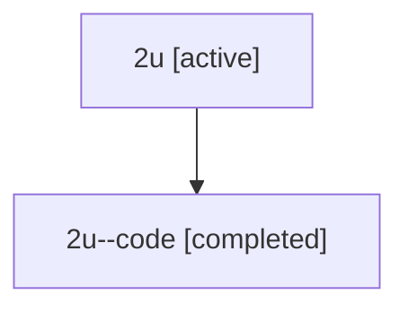

# Family: 2u

[Agent Hoods](../README.md) / [bbugyi200](../users/bbugyi200/README.md) / [athena](../users/bbugyi200/machines/athena/README.md) / [2u](../users/bbugyi200/machines/athena/hoods/2u/README.md) / 2u

Owner: `bbugyi200.athena` · Hood: `2u` · Members: 2

## Lineage

The diagram is an optional enhancement; the ordered table below contains the same lineage in accessible text.

| Role | Agent | State | Model / provider | Timing | Commits | Prompt | Chat |
|---|---|---|---|---|---:|---|---|
| root | 2u | active | opus / claude | 2026-07-08T19:52:59.292110+00:00 | [1](../agents/bbugyi200.athena.2u/README.md#commits) | [Prompt](../agents/bbugyi200.athena.2u/prompt.md) | [Chat](../agents/bbugyi200.athena.2u/chat.md) |
| code | 2u--code | completed | gpt-5.5 / codex | 2026-07-08T20:04:41.054138+00:00 | 0 | — | [Chat](../agents/bbugyi200.athena.2u--code/chat.md) |

## Commits

| Role | Repo | Commit | Subject | Committed |
|---|---|---|---|---|
| root | sase | [`6c07177`](https://github.com/sase-org/sase/commit/6c071774b49949f53200dc37594d15ab42b05fc2) | feat(vcs)!: add repository list view | 2026-07-08 16:21:20 EDT |
