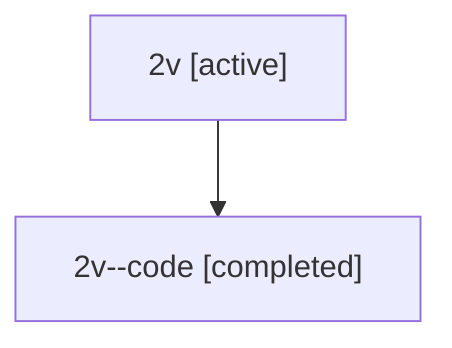

# Family: 2v

[Agent Hoods](../README.md) / [bbugyi200](../users/bbugyi200/README.md) / [athena](../users/bbugyi200/machines/athena/README.md) / [2v](../users/bbugyi200/machines/athena/hoods/2v/README.md) / 2v

Owner: `bbugyi200.athena` · Hood: `2v` · Members: 2

## Lineage

The diagram is an optional enhancement; the ordered table below contains the same lineage in accessible text.

| Role | Agent | State | Model / provider | Timing | Commits | Prompt | Chat |
|---|---|---|---|---|---:|---|---|
| root | 2v | active | opus / claude | 2026-07-08T22:11:58.313523+00:00 | 0 | [Prompt](../agents/bbugyi200.athena.2v/prompt.md) | [Chat](../agents/bbugyi200.athena.2v/chat.md) |
| code | 2v--code | completed | gpt-5.5 / codex | 2026-07-08T22:21:35.376866+00:00 | [1](../agents/bbugyi200.athena.2v--code/README.md#commits) | — | [Chat](../agents/bbugyi200.athena.2v--code/chat.md) |

## Commits

| Role | Repo | Commit | Subject | Committed |
|---|---|---|---|---|
| code | sase | [`9765fa7`](https://github.com/sase-org/sase/commit/9765fa7d6e3ed6435d5ab01b1a1699f7d2d8cdd2) | feat: surface SDD commits in agent metadata | 2026-07-08 22:36:41 UTC |
