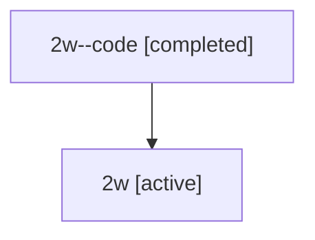

# Family: 2w

Owner: `bbugyi200.athena` · Hood: `2w` · Members: 2

## Lineage

The diagram is an optional enhancement; the ordered table below contains the same lineage in accessible text.

| Role | Agent | State | Model / provider | Timing | Commits | Prompt | Chat |
|---|---|---|---|---|---:|---|---|
| code | 2w--code | completed | gpt-5.5 / codex | 2026-07-08T22:35:01.474120+00:00 | 0 | — | [Chat](../agents/bbugyi200.athena.2w--code/chat.md) |
| root | 2w | active | opus / claude | 2026-07-08T22:23:41.230636+00:00 | 1 | [Prompt](../agents/bbugyi200.athena.2w/prompt.md) | [Chat](../agents/bbugyi200.athena.2w/chat.md) |
