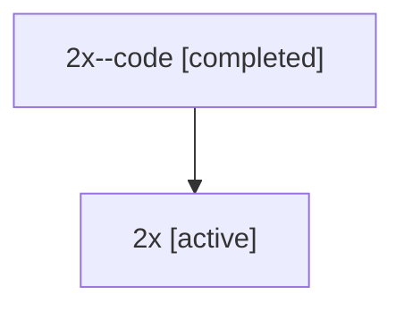

# Family: 2x

Owner: `bbugyi200.athena` · Hood: `2x` · Members: 2

## Lineage

The diagram is an optional enhancement; the ordered table below contains the same lineage in accessible text.

| Role | Agent | State | Model / provider | Timing | Commits | Prompt | Chat |
|---|---|---|---|---|---:|---|---|
| code | 2x--code | completed | gpt-5.5 / codex | 2026-07-08T22:44:27.762959+00:00 | 1 | — | [Chat](../agents/bbugyi200.athena.2x--code/chat.md) |
| root | 2x | active | opus / claude | 2026-07-08T22:30:10.621549+00:00 | 1 | [Prompt](../agents/bbugyi200.athena.2x/prompt.md) | [Chat](../agents/bbugyi200.athena.2x/chat.md) |
