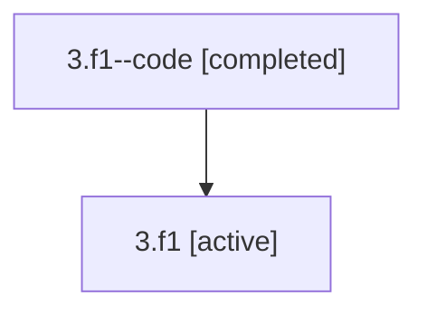

# Family: 3.f1

[Agent Hoods](../README.md) / [bbugyi200](../users/bbugyi200/README.md) / [athena](../users/bbugyi200/machines/athena/README.md) / [3](../users/bbugyi200/machines/athena/hoods/3/README.md) / 3.f1

Owner: `bbugyi200.athena` · Hood: `3` · Members: 2

## Lineage

The diagram is an optional enhancement; the ordered table below contains the same lineage in accessible text.

| Role | Agent | State | Model / provider | Timing | Commits | Prompt | Chat |
|---|---|---|---|---|---:|---|---|
| code | 3.f1--code | completed | gpt-5.5 / codex | 2026-07-06T11:04:41.930217+00:00 | 0 | — | [Chat](../agents/bbugyi200.athena.3.f1--code/chat.md) |
| root | 3.f1 | active | claude-fable-5 / claude | 2026-07-06T11:01:48.494418+00:00 | [2](../agents/bbugyi200.athena.3.f1/README.md#commits) | [Prompt](../agents/bbugyi200.athena.3.f1/prompt.md) | [Chat](../agents/bbugyi200.athena.3.f1/chat.md) |

## Commits

| Role | Repo | Commit | Subject | Committed |
|---|---|---|---|---|
| root | sase | [`147c303`](https://github.com/sase-org/sase/commit/147c3038ba7c4fd1951a9ce5c072e346431d65ce) | chore: Add SDD prompt and plan for sase\_telegram\_mit\_license | 2026-07-06 07:04:40 EDT |
| root | sase | [`fb80faa`](https://github.com/sase-org/sase/commit/fb80faa6d314bd96bff9f02f63f33545c2f4ecbb) | chore: Mark SDD plan done | 2026-07-06 07:50:04 EDT |

## Neighbors

| Agent | Relation | State |
|---|---|---|
| [3](bbugyi200.athena.3.md) (family · 2) | ancestor | active 1, completed 1 |
