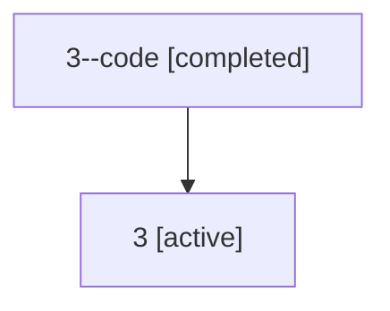

# Family: 3

[Agent Hoods](../README.md) / [bbugyi200](../users/bbugyi200/README.md) / [athena](../users/bbugyi200/machines/athena/README.md) / [3](../users/bbugyi200/machines/athena/hoods/3/README.md) / 3

Owner: `bbugyi200.athena` · Hood: `3` · Members: 2

## Lineage

The diagram is an optional enhancement; the ordered table below contains the same lineage in accessible text.

| Role | Agent | State | Model / provider | Timing | Commits | Prompt | Chat |
|---|---|---|---|---|---:|---|---|
| code | 3--code | completed | gpt-5.5 / codex | 2026-07-06T10:48:38.360072+00:00 | 0 | — | [Chat](../agents/bbugyi200.athena.3--code/chat.md) |
| root | 3 | active | claude-fable-5 / claude | 2026-07-06T10:44:13.003894+00:00 | [4](../agents/bbugyi200.athena.3/README.md#commits) | [Prompt](../agents/bbugyi200.athena.3/prompt.md) | [Chat](../agents/bbugyi200.athena.3/chat.md) |

## Commits

| Role | Repo | Commit | Subject | Committed |
|---|---|---|---|---|
| root | sase | [`418f0ac`](https://github.com/sase-org/sase/commit/418f0ac3e2f9449b53076ab94142e8b4437238fc) | chore: Add SDD prompt and plan for zorg\_live\_artifact\_cleanup | 2026-06-02 07:23:57 EDT |
| root | sase | [`3276c82`](https://github.com/sase-org/sase/commit/3276c827f2e46b2c1e0967b05ae2060c02574bdf) | docs: add PyPI version badge | 2026-06-13 08:18:51 EDT |
| root | sase | [`a98b985`](https://github.com/sase-org/sase/commit/a98b9856e38efb8075f6eb3dde9322b0b6dd93e1) | chore: Add SDD prompt and plan for sase\_github\_mit\_license | 2026-07-06 06:48:37 EDT |
| root | sase | [`f6bc9ae`](https://github.com/sase-org/sase/commit/f6bc9ae66fe48c5ab0e0d0c3c9d1b6bc241e844c) | chore: Mark SDD plan done | 2026-07-06 07:47:19 EDT |

## Neighbors

| Agent | Relation | State |
|---|---|---|
| [3.f1](bbugyi200.athena.3.f1.md) (family · 2) | descendant | active 1, completed 1 |
