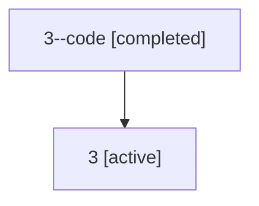

# Family: 3

Owner: `bbugyi200.athena` · Hood: `3` · Members: 2

## Lineage

The diagram is an optional enhancement; the ordered table below contains the same lineage in accessible text.

| Role | Agent | State | Model / provider | Timing | Commits | Prompt | Chat |
|---|---|---|---|---|---:|---|---|
| code | 3--code | completed | gpt-5.5 / codex | 2026-07-06T10:48:38.360072+00:00 | 0 | — | [Chat](../agents/bbugyi200.athena.3--code/chat.md) |
| root | 3 | active | claude-fable-5 / claude | 2026-07-06T10:44:13.003894+00:00 | 4 | [Prompt](../agents/bbugyi200.athena.3/prompt.md) | [Chat](../agents/bbugyi200.athena.3/chat.md) |
