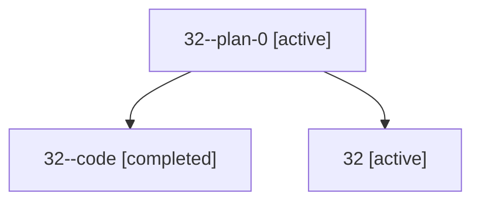

# Family: 32

[Agent Hoods](../README.md) / [bbugyi200](../users/bbugyi200/README.md) / [athena](../users/bbugyi200/machines/athena/README.md) / [32](../users/bbugyi200/machines/athena/hoods/32/README.md) / 32

Owner: `bbugyi200.athena` · Hood: `32` · Members: 3

## Lineage

The diagram is an optional enhancement; the ordered table below contains the same lineage in accessible text.

| Role | Agent | State | Model / provider | Timing | Commits | Prompt | Chat |
|---|---|---|---|---|---:|---|---|
| plan-0 | 32--plan-0 | active | gpt-5.5 / codex | 2026-07-09T00:34:24.543800+00:00 | 0 | — | [Chat](../agents/bbugyi200.athena.32--plan-0/chat.md) |
| code | 32--code | completed | gpt-5.5 / codex | 2026-07-09T00:45:52.043650+00:00 | 0 | — | [Chat](../agents/bbugyi200.athena.32--code/chat.md) |
| root | 32 | active | gpt-5.5 / codex | 2026-07-09T00:25:18.707843+00:00 | [1](../agents/bbugyi200.athena.32/README.md#commits) | [Prompt](../agents/bbugyi200.athena.32/prompt.md) | [Chat](../agents/bbugyi200.athena.32/chat.md) |

## Commits

| Role | Repo | Commit | Subject | Committed |
|---|---|---|---|---|
| root | sase | [`494ba4e`](https://github.com/sase-org/sase/commit/494ba4ecff63f96b9624af5ecfabbefbb52203e0) | refactor(xprompt): rename multi-agent xprompt to xprompt swarm | 2026-07-08 20:57:40 EDT |
