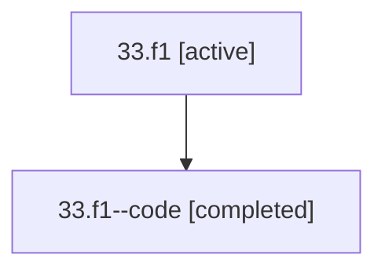

# Family: 33.f1

[Agent Hoods](../README.md) / [bbugyi200](../users/bbugyi200/README.md) / [athena](../users/bbugyi200/machines/athena/README.md) / [33](../users/bbugyi200/machines/athena/hoods/33/README.md) / 33.f1

Owner: `bbugyi200.athena` · Hood: `33` · Members: 2

## Lineage

The diagram is an optional enhancement; the ordered table below contains the same lineage in accessible text.

| Role | Agent | State | Model / provider | Timing | Commits | Prompt | Chat |
|---|---|---|---|---|---:|---|---|
| root | 33.f1 | active | gpt-5.5 / codex | 2026-07-09T01:51:39.518129+00:00 | [1](../agents/bbugyi200.athena.33.f1/README.md#commits) | [Prompt](../agents/bbugyi200.athena.33.f1/prompt.md) | [Chat](../agents/bbugyi200.athena.33.f1/chat.md) |
| code | 33.f1--code | completed | gpt-5.5 / codex | 2026-07-09T01:56:04.663385+00:00 | [1](../agents/bbugyi200.athena.33.f1--code/README.md#commits) | — | [Chat](../agents/bbugyi200.athena.33.f1--code/chat.md) |

## Commits

| Role | Repo | Commit | Subject | Committed (UTC) |
|---|---|---|---|---|
| code | sase | [`5b50fc5`](https://github.com/sase-org/sase/commit/5b50fc5fd230352282b36cb87ff49ee37720b0db) | feat: refresh materialized SDD companions through providers | 2026-07-09 02:08:54 |
| root | sase | [`5b50fc5`](https://github.com/sase-org/sase/commit/5b50fc5fd230352282b36cb87ff49ee37720b0db) | feat: refresh materialized SDD companions through providers | 2026-07-09 02:08:54 |

## Neighbors

| Agent | Relation | State |
|---|---|---|
| [33](bbugyi200.athena.33.md) (family · 2) | ancestor | active 1, completed 1 |
| [33.r1.f1.f1](../agents/bbugyi200.athena.33.r1.f1.f1/README.md) | 33 hood | completed |
