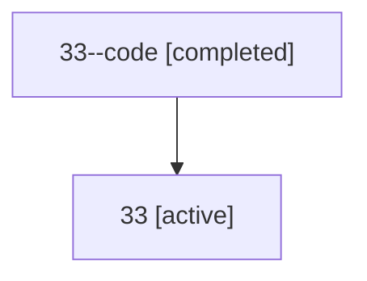

# Family: 33

[Agent Hoods](../README.md) / [bbugyi200](../users/bbugyi200/README.md) / [athena](../users/bbugyi200/machines/athena/README.md) / [33](../users/bbugyi200/machines/athena/hoods/33/README.md) / 33

Owner: `bbugyi200.athena` · Hood: `33` · Members: 2

## Lineage

The diagram is an optional enhancement; the ordered table below contains the same lineage in accessible text.

| Role | Agent | State | Model / provider | Timing | Commits | Prompt | Chat |
|---|---|---|---|---|---:|---|---|
| code | 33--code | completed | gpt-5.5 / codex | 2026-07-09T01:11:21.545110+00:00 | 0 | — | [Chat](../agents/bbugyi200.athena.33--code/chat.md) |
| root | 33 | active | opus / claude | 2026-07-09T00:57:38.748177+00:00 | [1](../agents/bbugyi200.athena.33/README.md#commits) | [Prompt](../agents/bbugyi200.athena.33/prompt.md) | [Chat](../agents/bbugyi200.athena.33/chat.md) |

## Commits

| Role | Commit | Subject | Committed (UTC) |
|---|---|---|---|
| root | [`46670fb`](https://github.com/sase-org/sase/commit/46670fbf4d2afccdc30cf6ec344d5a003d358f3b) | feat(sdd): create companion repo during init | 2026-07-09 01:31:46 |

## Neighbors

| Agent | Relation | State |
|---|---|---|
| [33.f1](bbugyi200.athena.33.f1.md) (family · 2) | descendant | active 1, completed 1 |
| [33.r1.f1.f1](../agents/bbugyi200.athena.33.r1.f1.f1/README.md) | descendant | dismissed |
