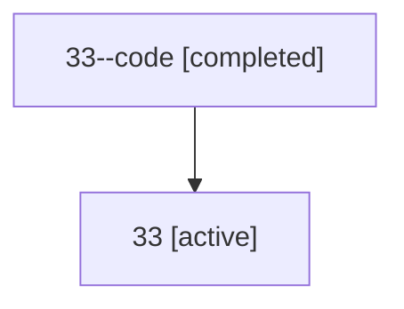

# Family: 33

Owner: `bbugyi200.athena` · Hood: `33` · Members: 2

## Lineage

The diagram is an optional enhancement; the ordered table below contains the same lineage in accessible text.

| Role | Agent | State | Model / provider | Timing | Commits | Prompt | Chat |
|---|---|---|---|---|---:|---|---|
| code | 33--code | completed | gpt-5.5 / codex | 2026-07-09T01:11:21.545110+00:00 | 0 | — | [Chat](../agents/bbugyi200.athena.33--code/chat.md) |
| root | 33 | active | opus / claude | 2026-07-09T00:57:38.748177+00:00 | 1 | [Prompt](../agents/bbugyi200.athena.33/prompt.md) | [Chat](../agents/bbugyi200.athena.33/chat.md) |
